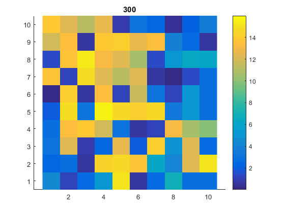

# Cellular Growth Simulation

### Overview
The program aims to model stem cell proliferation in a finite spaced cellular automata and observe its interactions with neighbouring cells. Attributes such as the generation, parents, ancestors, time of birth and time of split of a cell are tracked in in a multidimensional array data structure.

### Files
* main.m runs the program
* LAYERS contains constant indices for the indexing the grid
* Other files are additional functions required to run the program

### Matlab compatibility
This program was written in Matlab R2016b, but should work with all version of Matlab. Only built-in functions are used.

### Todo:
* Create object for keeping track of lineage
* Assign better variable and function names
* Organise functions into folders
